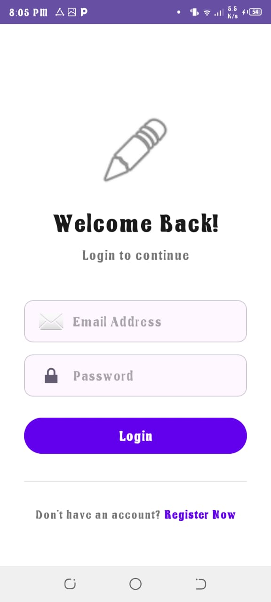
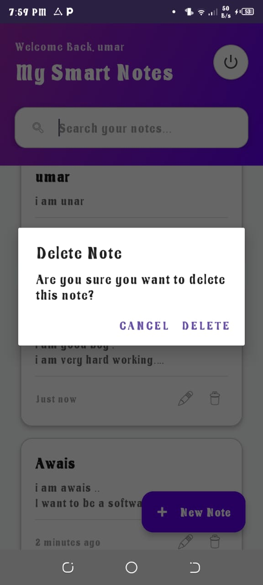
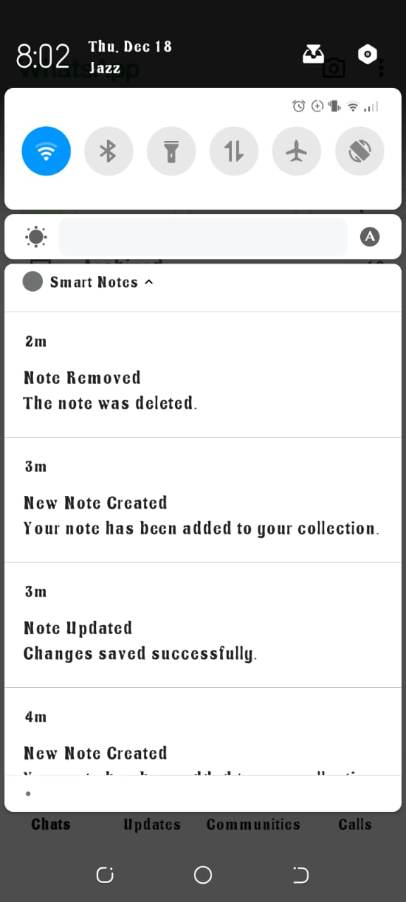

#  Smart Notes – Cloud-Based Note Taking App

Smart Notes is an Android application built with **Kotlin** and **Firebase** that allows users to securely create, manage, and store personal notes in the cloud. Each user has a private account, ensuring data security and accessibility across multiple devices.

---

## Features

*  **User Authentication**

    Secure sign-up and login using Firebase Authentication

*  **Notes Management (CRUD)**

    * Create notes
    * View notes
    * Update notes
    * Delete notes

*  **Cloud Storage**

    * Notes are stored securely in Firebase Firestore
    * Data is synced across devices

*  **Search Notes**

     Search notes by title or keywords

*  **Timestamps**

    Automatic creation and last updated time for each note

*  **Notifications**

    Notifications are shown when:

    * User logs in
    * A note is created
    * A note is updated
    * A note is deleted
    Enhances user feedback and user experience

*  **Logout**

    Secure logout functionality

---

##  Tech Stack

* **Language:** Kotlin
* **Backend:** Firebase

  * Firebase Authentication
  * Firebase Firestore
* **Architecture:** MVVM
* **UI Components:** Material Design, RecyclerView

---

##  App Screens

  
  
  

  
  
  

  
  
  

  

---

##  Purpose of the Project

The goal of this project is to build a secure and user-friendly cloud-based note-taking app while gaining hands-on experience with:

* Android App Development
* Firebase Integration
* MVVM Architecture
* Cloud CRUD Operations

---

##  Future Improvements

* Voice notes
* Image attachments
* Dark mode
* Note categories
* Offline mode
* Reminders

---

## 👨‍💻 Developed By

* **Muhammad Usama Sarwar**
* **Muhammad Awais Ramzan**

**Department:** Software Engineering
**Semester:** 7th Morning

---

